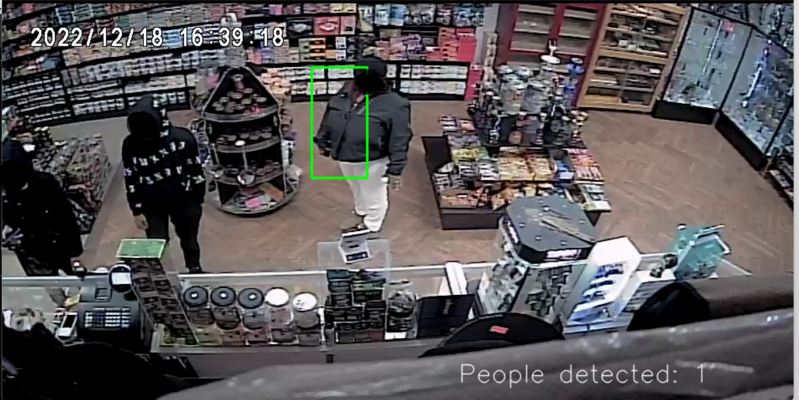
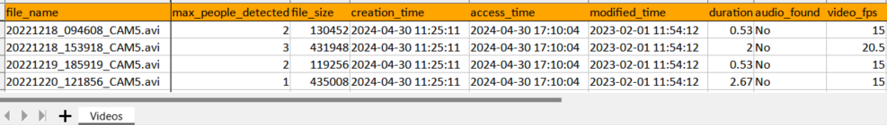

forked from https://github.com/nddbk/people-detecting/

```
pip install -r requirements_people-detecting.txt
```
insert videos into your videos sub folder

```
python peopleCount2.py -c
```






# people-detecting
Detect people from video/camera using OpenCV

This was created to try some algorighms for detecting people from video/camera. 

```
git clone https://github.com/ndaidong/people-detecting.git
cd people-detecting
git checkout BRANCH

python3 -m venv venv
source venv/bin/activate

pip install -r requirements.txt

python start.py
```


### Methods

- [accumulateWeighted](https://github.com/ndaidong/people-detecting/tree/accumulateWeighted)
- [Pedestrian Detection](https://github.com/ndaidong/people-detecting/tree/Pedestrian)
- [Follow movement](https://github.com/ndaidong/people-detecting/tree/FollowMovement)
- [YOLO](https://github.com/ndaidong/people-detecting/tree/YOLO)

*(continuous)*


